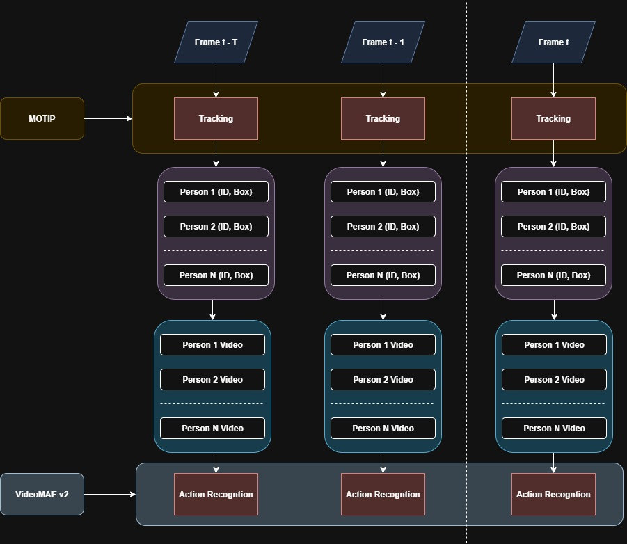

# Multi-Person Behavior Tracking




This diagram illustrates a multi-stage Multi-Person Behavior Tracking workflow, combining Multi-Object Tracking (MOT) with Action Recognition.

**Multi-Object Tracking (MOT) with MOTIP**
- The process begins with the MOTIP module.
- For each video frame (from Frame t - T to Frame t), MOTIP performs "Tracking."
- The output of the tracking stage for each frame is a list of detected persons, each identified by a unique ID and their corresponding bounding Box (location/size). This implies MOTIP maintains consistent IDs for individuals across consecutive frames.

**Individual Person Video Extraction**: Based on the tracking results (Person ID, Box), individual video segments are extracted for each tracked person.

**Action Recognition with VideoMAE-v2**: The extracted "Person N Video" streams are then fed into the VideoMAE-v2 module.

## MOT with MOTIP

We use MOTIP to run video on DanceTrack and SportsMOT.

[DanceTrack](demo/motip/dancetrack.mp4 "Click to watch")

[SportsMOT](demo/motip/sportmot.mp4 "Click to watch")

## Action Recognition with VideoMAE-v2
The all data and code for reproduce put in VideoMAEv2


# Reference
- MOTIP: Multiple Object Tracking as ID Prediction
    + [Offical Repository](https://github.com/MCG-NJU/MOTIP)
    + [Paper](https://arxiv.org/abs/2403.16848)
    ```
    @InProceedings{{MOTIP},
        author    = {Gao, Ruopeng and Qi, Ji and Wang, Limin},
        title     = {Multiple Object Tracking as ID Prediction},
        booktitle = {Proceedings of the Computer Vision and Pattern Recognition Conference (CVPR)},
        month     = {June},
        year      = {2025},
        pages     = {27883-27893}
    }
    ```
- VideoMAE-v2:  Scaling Video Masked Autoencoders with Dual Masking.
    + [Office Repository](https://github.com/OpenGVLab/VideoMAEv2)
    + [Paper](https://arxiv.org/abs/2303.16727)
    ```
    @misc{wang2023videomaev2scalingvideo,
        title={VideoMAE V2: Scaling Video Masked Autoencoders with Dual Masking}, 
        author={Limin Wang and Bingkun Huang and Zhiyu Zhao and Zhan Tong and Yinan He and Yi Wang and Yali Wang and Yu Qiao},
        year={2023},
        eprint={2303.16727},
        archivePrefix={arXiv},
        primaryClass={cs.CV},
        url={https://arxiv.org/abs/2303.16727}, 
    }
    ```